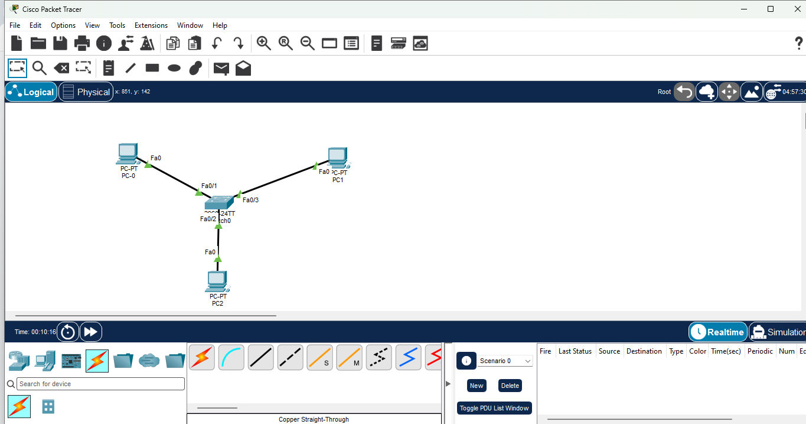
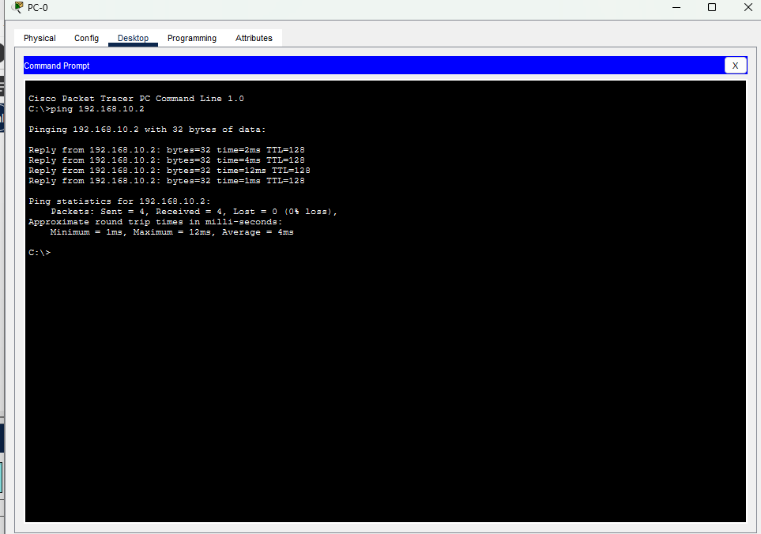

# packet-tracer-24-subnet
Basic Class C LAN setup demonstrating the /24 subnet mask
# Basic /24 Local Area Network (LAN) Configuration

## Objective
To demonstrate a foundational understanding of Class C IPv4 addressing and the `/24` subnet mask (`255.255.255.0`) by configuring static IP addresses within the same network segment and verifying local connectivity.

## Network Topology

## Addressing Table

| Device | Interface | IP Address | Subnet Mask | Connected To |
| :--- | :--- | :--- | :--- | :--- |
| PC-0 | FastEthernet0 | 192.168.10.1 | 255.255.255.0 | Switch Port Fa0/1 |
| PC-1 | FastEthernet0 | 192.168.10.2 | 255.255.255.0 | Switch Port Fa0/2 |
| PC-2 | FastEthernet0 | 192.168.10.3 | 255.255.255.0 | Switch Port Fa0/3 |

## Verification & Testing
To verify end-to-end connectivity, I initiated an ICMP echo request (ping) from PC-0 to PC-2. The successful replies prove proper Layer 2 switching and correct IP assignment within the `192.168.10.0/24` network segment.

